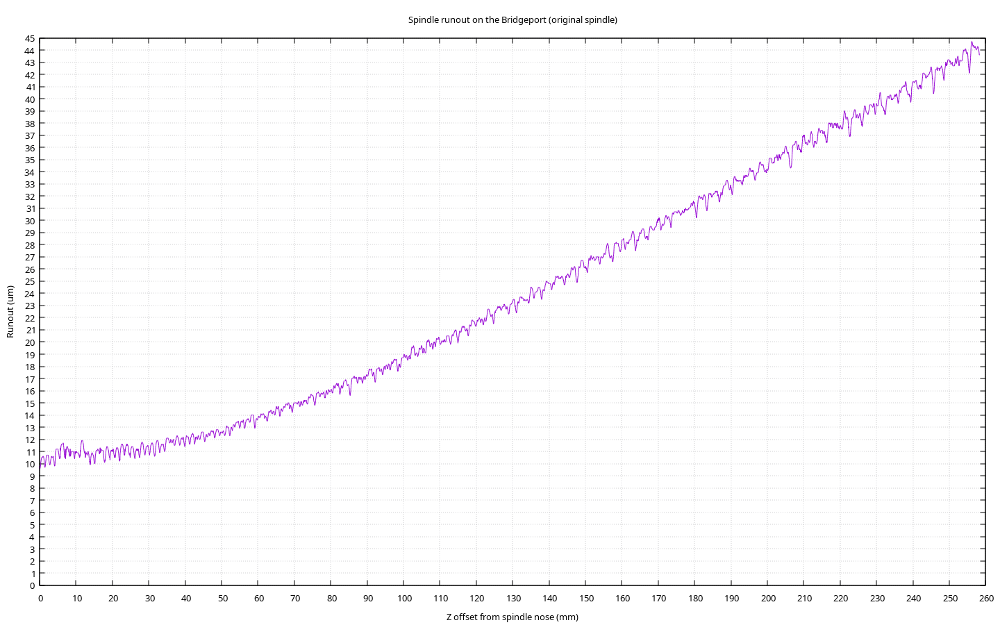

# Methodology

I attached an extremely slow DC motor to the spindle of my Bridgeport. I put
the spindle in neutral and rotate the spindle at an arbitrary speed (turned
out to be 2.5625 rpm). An indicator is probing an R8 test bar in the spindle
and recording data every 200ms. Due to runout, this will produce a sine-wave
showing the high and low spots. From this sine wave I'm able to use DFT to
recover the frequency of rotations.

I then put the machine into power downfeed at a very slow speed (about 3.58
mm/min). This means that I'm tracing a helix over the entire length of the
test bar, producing data continuously. I'm recording the absolute data here,
which also includes information about the milling Z axis trueness to the Z
axis of the spindle, this is information that we ignore/discard but it's in
there.

We filter the data to remove this noise by only caring about the local
amplitude of the wave. This means that the Z travel over one cycle of data
is about ~1.4mm, which is such a small amount of Z travel that it should
effectively eliminate noise from the Z axis of the machine. We're effectively
measuring the runout for a single rotation.

My test bar has information (like the serial number) laser engraved on it which
produces some noise in the data. To smooth this out for each data point I look
ahead for one cycle of data. I then recover the phase of the data to sync it
up with a sine wave, and then I recover the amplitude of the data by doing
a sum of least squares with various amplitudes. This is all effectively DFT,
which is quite slow but it's just not that much data that it's not worth
optimizing the code/using FFT. As a result, I create a best fit sine wave for
every single data point looking ahead for 1 cycle worth of data, and then plot
the amplitude of this sine wave, which is the runout of the spindle!

[](https://www.youtube.com/watch?v=R3dG70C5ZAU)

# Results



# Info about the measurement

- Data format for log fiels is:
  `[(seconds since UNIX epoch: f64, indicator reading in mm: f64); N]`

- Spindle spun counter clockwise. RPM is undefined, can be derived from the
  cycles of the data. Powered by DC motor through O ring gripping on the
  spindle nose.

- Z power feed used to move the milling table down (-Z) during the sweep

- One indicator was measuring Z speed, had to be reset multiple times due to
  limited travel (0.5"). This is just a reference for speed

- Total Z distance travelled from start of movement (see where ITN61000710
  starts descending to see when power feed was engaged) to fall off of data,
  259.7mm according to DRO Z axis

- Indicator was centered by finding high point at starting point

- Indicator was re-centered at the end to validate there was no significant
  change in centering (eg. mill nod). (<50um off center)

```
                     ------+     +---
                      ^    |     |
                      ||   \     / <--- Spindle
                      ||    |   | <- Starting point
                     /  \   |   |
                     |  |   |   |
                     \  /   |   | <- Test bar
    Indicator ITN61000710   |   |
    Used to calibrate Z     |   |
    speed at various        |   |       /-\
    points                  |   | c====|   | Indicator ITN61000712
             Ending point ->\___/       \-/
```

- RPM clocked to 2.5625 rpm using DFT across the entire data set

- Z power feed clocked to 59.70 um/sec

